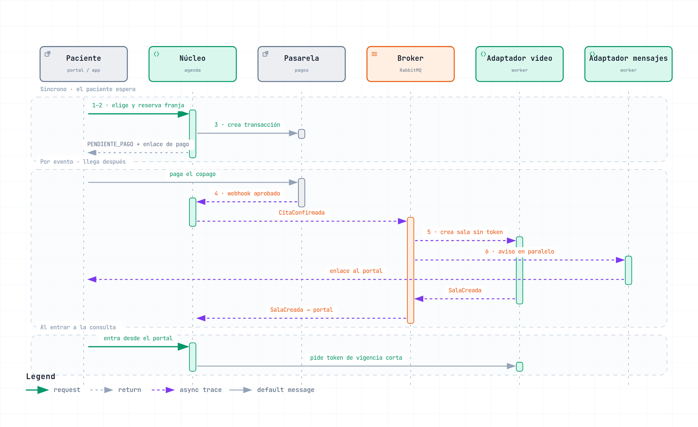
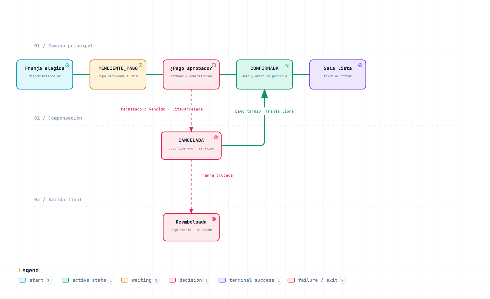

# Flujo: agendar una cita virtual

Actividad «Del flujo al patrón» · Caso 4, Citas médicas y telemedicina · Grupo 4

**Supuesto A-02.** El copago de la cita virtual se paga en línea al agendar. Por eso entra la pasarela de pagos como octavo actor.

## Paso 1. El flujo

| # | Paso | Quién |
|---|---|---|
| 1 | **Verificar disponibilidad** del profesional en la franja elegida | Módulo de agenda (núcleo) |
| 2 | **Reservar el cupo** con un bloqueo de 15 minutos; la cita queda en `PENDIENTE_PAGO` | Módulo de agenda (núcleo) |
| 3 | **Iniciar el pago:** crear la transacción y devolverle al paciente el enlace de pago | Núcleo → pasarela de pagos |
| 4 | **Confirmar el pago:** la pasarela avisa por webhook; la cita pasa a `CONFIRMADA` y el núcleo publica `CitaConfirmada`, o pasa a `CANCELADA` y publica `CitaCancelada` | Pasarela de pagos → núcleo |
| 5 | **Crear la sala de video**, sin token. Al terminar publica `SalaCreada` | Adaptador de video (worker) |
| 6 | **Enviar el aviso** al paciente con fecha, hora, sede y el enlace al **portal**, sin datos clínicos | Adaptador de mensajería (worker) |

Los pasos 5 y 6 consumen `CitaConfirmada` y corren en paralelo: ninguno espera al otro.

Cuando el paciente entra a la consulta desde el portal, el núcleo le pide al adaptador de video un token de vigencia corta. Esa llamada es síncrona porque el paciente está esperando para entrar, y no hace parte del agendamiento.

## Paso 2. Decisión paso por paso

La pregunta del laboratorio: ¿el paciente necesita que este paso haya terminado para saber que su acción funcionó? El paciente solo espera los pasos 1 a 3.

| # | Paso | Quién | Síncrono o evento | Si falla | Si se repite |
|---|---|---|---|---|---|
| 1 | Verificar disponibilidad | Agenda | Síncrono | Nada que deshacer. Se le ofrece otra franja. | Es solo lectura, no pasa nada. |
| 2 | Reservar cupo (bloqueo 15 min) | Agenda | Síncrono | Nada que deshacer: no alcanzó a cambiar nada. | Idempotente por **id de solicitud** que manda el cliente. Además, restricción única (profesional, franja) en la base de datos. |
| 3 | Iniciar pago | Pasarela | Síncrono, timeout de 5 s | **Compensa:** liberar el cupo. | Idempotente por **id de cita**, que va como referencia a la pasarela: no se crean dos transacciones. |
| 4 | Confirmar pago | Pasarela → núcleo | Evento (webhook) | **Compensa:** si el pago se rechaza o el bloqueo vence, la cita pasa a `CANCELADA`, se publica `CitaCancelada`, se libera el cupo y se le avisa al paciente que la cita no quedó agendada. Si el webhook no llega, se consulta el estado a la pasarela antes de liberar. Si el pago llega aprobado cuando el cupo ya se liberó, se reasigna si la franja sigue libre; si no, se reembolsa y se le avisa al paciente. | Idempotente por **id de transacción**. Las pasarelas reenvían el webhook hasta recibir 200. |
| 5 | Crear sala (sin token) | Adaptador de video | Evento (`CitaConfirmada`) | La cita no se deshace. Reintentos con espera creciente, luego cola de mensajes muertos y alerta al administrativo. El aviso del paso 6 sale igual; el portal muestra «sala en preparación» hasta recibir `SalaCreada`. | Idempotente por **id de cita**: una cita, una sala. |
| 6 | Enviar aviso con enlace al portal | Adaptador de mensajería | Evento (`CitaConfirmada`), en paralelo con el 5 | **Sin compensación posible:** un mensaje enviado no se recoge. Reintentos y cola de mensajes muertos; la cita se ve igual en el portal. | Idempotente por **id de cita + tipo de mensaje**, con registro de envíos guardado en la base de datos. |

### Eventos

| Evento | Lo publica | Lo consumen |
|---|---|---|
| `CitaConfirmada` | Núcleo, al recibir el webhook de pago aprobado | Adaptador de video (paso 5), adaptador de mensajería (paso 6), auditoría |
| `CitaCancelada` | Núcleo, cuando el pago se rechaza o el bloqueo vence | Adaptador de mensajería (aviso de cita no agendada), auditoría |
| `SalaCreada` | Adaptador de video, al crear la sala | Núcleo, para mostrar la sala en el portal |

**Auditoría.** El metadato del agendamiento (quién agendó, cuándo, en qué estado quedó la cita) llega a la auditoría por evento. El acceso a la historia clínica sigue auditándose de forma síncrona, pero no participa en este flujo.

### Diagramas

*Figura 1. Secuencia del flujo. Los pasos 1 a 3 ocurren mientras el paciente espera; el resto llega por eventos. Versión interactiva: [`diagramas/secuencia-agendar-cita.html`](diagramas/secuencia-agendar-cita.html).*

*Figura 2. Estados de la cita. Una tarea programada dentro del núcleo revisa los bloqueos vencidos. Versión interactiva: [`diagramas/estados-cita.html`](diagramas/estados-cita.html).*

## Por qué así

**Dónde se corta.** Lo que el paciente necesita saber es que tiene el cupo apartado y cómo pagar. Eso es síncrono (pasos 1 a 3). El resultado del pago no depende de nosotros: el paciente paga en la página de la pasarela y ella avisa cuando quiera, así que el paso 4 es evento sí o sí.

**La sala y el aviso en paralelo.** Crear la sala es el paso tramposo. Si fuera síncrono, una caída del proveedor de video impediría agendar, y eso va contra EC-02 (0 % de solicitudes de agenda rechazadas por la caída de un tercero). Tampoco conviene que el aviso espere a `SalaCreada`: con el video caído, un paciente que ya pagó se quedaría sin confirmación. Como el aviso lleva el enlace al portal y no a la sala, no necesita que la sala exista.

**El token se emite al entrar.** Las citas se agendan con días de anticipación. Un token de vigencia corta creado junto con la sala estaría vencido el día de la consulta. Emitirlo cuando el paciente entra resuelve eso, y el enlace del aviso nunca caduca porque apunta al portal.

**Avisar la cancelación.** Si la pasarela rechaza el pago, el paciente lo ve en la página de la pasarela, pero no sabe qué pasó con su cita. Y si abandona el pago, nadie le dice que el bloqueo venció y que perdió la franja. Por eso el adaptador de mensajería también consume `CitaCancelada` y le avisa que la cita no quedó agendada, con enlace al portal para volver a intentarlo. Ese aviso es idempotente por id de cita + tipo de mensaje, igual que el de confirmación.

**El orden.** El aviso es el único paso que no se puede deshacer, por eso sale solo después de que el pago está confirmado. Así nunca se le avisa al paciente de una cita que luego se cancela por falta de pago.
