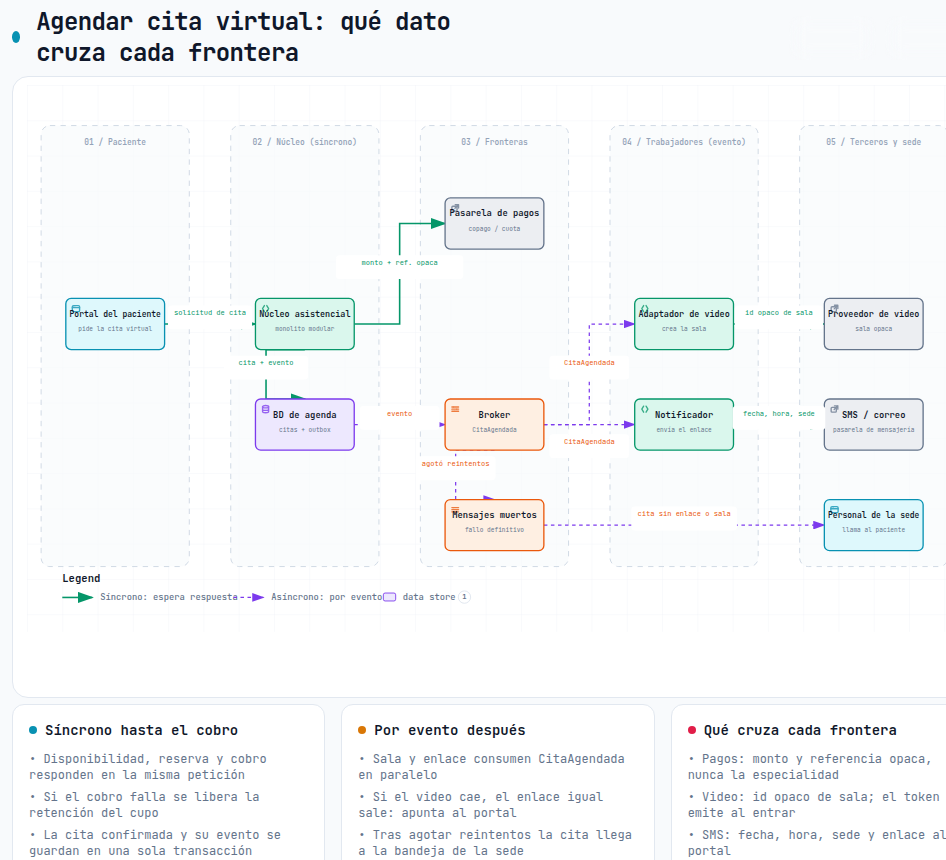

# Flujo: agendar una cita virtual

Caso 4 · Grupo 4 · Actividad "Del flujo al patrón".

Flujo sugerido por el docente: verificar disponibilidad, reservar, cobrar, enviar enlace de la consulta.
Separamos **crear la sala** como paso propio porque depende de un tercero distinto (el proveedor de video).

## Supuesto nuevo A-02 — cobro en línea del copago

El copago o cuota moderadora de la teleconsulta se cobra en línea con una pasarela de pagos al agendar.
Si el paciente está exento, el paso 3 solo confirma la cita.

Esto agrega un **octavo actor** al contexto (Pasarela de pagos), que no estaba en el Cuestionario 1.
Si el supuesto es falso (el copago se cobra en sede), el paso 3 desaparece y la cita se confirma al retener el cupo.

## Pasos

1. El núcleo (módulo de agenda) verifica disponibilidad por especialidad, profesional y franja.
2. El núcleo retiene el cupo por 10 minutos (supuesto del grupo).
3. El núcleo cobra en la pasarela; si se aprueba, confirma la cita y escribe `CitaAgendada` en el outbox en la misma transacción.
4. El adaptador de video crea la sala con un identificador opaco.
5. El notificador envía por SMS o correo el enlace al portal.

## Decisión paso por paso

| Paso | Quién | Síncrono o evento | Si falla | Si se repite |
|---|---|---|---|---|
| 1. Verificar disponibilidad | Núcleo · agenda | Síncrono | Nada que deshacer | Es una lectura: inocuo |
| 2. Retener cupo | Núcleo · agenda | Síncrono | Nada que deshacer; si otro ganó la franja se ofrecen otras | Idempotente por id de solicitud (`Idempotency-Key` que manda el portal); la restricción única (profesional, franja) impide la doble reserva |
| 3. Cobrar y confirmar | Núcleo → pasarela de pagos | Síncrono, timeout 8 s | Rechazo: liberar la retención. Timeout: no liberar a ciegas, consultar el estado con la clave de idempotencia; si el pago aparece aprobado después de liberar, reembolso automático | Idempotente por id de reserva, enviado a la pasarela como clave de idempotencia; confirmar es una transición condicional `RETENIDA → CONFIRMADA` |
| 4. Crear sala | Adaptador de video | Evento (`CitaAgendada`) | Reintentos con espera creciente y circuit breaker; si 2 h antes de la cita no hay sala, va a mensajes muertos y a la bandeja de la sede para reagendar o pasar a presencial. El cobro no se revierte | Idempotente por id de cita: si la sala ya existe, se devuelve la misma |
| 5. Enviar enlace | Notificador → pasarela de mensajería | Evento (`CitaAgendada`) | **Sin compensación posible**: un SMS no se "desenvía". Reintento con tiempo de vida; si falla definitivamente, la cita queda "sin enlace confirmado" y la sede llama. El enlace igual está en el portal | Idempotente por (id de cita, tipo `ENLACE`) persistido. Se acepta el duplicado residual: un SMS repetido molesta, uno perdido cuesta una cita |

## Por qué este orden

- **Lo que no tiene compensación va al final**: el mensaje sale solo cuando el pago ya está confirmado.
- **Retener antes de cobrar**: liberar un cupo es barato; reembolsar no.
- **Los pasos 4 y 5 corren en paralelo.** El enlace apunta al portal (`/citas/{id}`), no a la sala ni al token.
  Si el proveedor de video está caído, el enlace sale igual, y el token de vigencia corta se emite cuando el paciente entra.
  Así el SMS nunca transporta un token que caduca ni un dato del proveedor.

## El paso del medio: cobrar

Va síncrono porque el paciente necesita saber en la misma respuesta si la cita quedó confirmada.

Lo consideramos por evento (confirmar primero y cobrar después), pero entonces la compensación sería cancelar una cita
que el paciente ya vio confirmada.

Si la pasarela cae, el circuit breaker corta la llamada: la agenda y el agendamiento presencial siguen operando (EC-02),
y la cita virtual queda "pendiente de pago" hasta que vence la retención.

## Qué dato cruza cada frontera

| Frontera | Cruza | Nunca cruza |
|---|---|---|
| Pasarela de pagos | Monto, referencia opaca de la reserva | Especialidad, motivo, profesional |
| Proveedor de video | Identificador opaco de sala; token de vigencia corta al entrar | Identidad real del paciente, historia clínica |
| Pasarela de mensajería | Nombre, fecha, hora, sede, enlace al portal | Especialidad, motivo, token de video |

Diagrama interactivo: [`diagramas/flujo-agendar-cita.html`](diagramas/flujo-agendar-cita.html) (fuente: `diagramas/flujo-agendar-cita.dataflow.json`, generado con Archify).

## Qué cambió respecto al Cuestionario 1

- **Nuevo tercero: pasarela de pagos.** Sigue la misma regla de integración sin fuga. El diagrama de contexto pasa a 8 actores y 16 flechas.
- **Se mantiene**: la reserva del cupo es síncrona (P7), la mensajería va por cola (P7) y los adaptadores quedan
  fuera del proceso principal, desacoplados por cola (P6).
