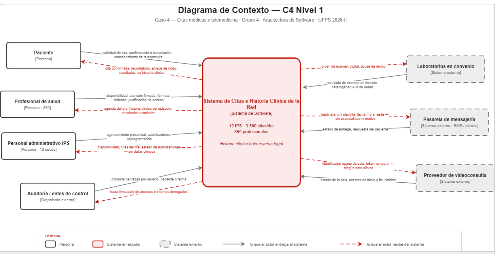

# Visión del sistema — Cuestionario 1

Grupo 4 · Caso 4 — Citas médicas y telemedicina · Arquitectura de Software · UFPS 2026-II · Semana 4

Integrantes: Wilhen Ferney Gutiérrez Pabón (líder) · Javier Sneider Rincón Moreno · Angel Leonardo Montañez Corredor ·
Nefer Sneyder Rojas Porras · Kevin David Zorro Hernández · Juan Camilo Uribe Mendoza

## 0. Supuestos declarados

Ninguna medida de este documento usa un número que no aparezca en esta tabla.

| Dato | Origen | Cálculo o justificación |
|---|---|---|
| 3.500 citas diarias · 350 profesionales · 12 IPS | Caso, sección 1 | Dato directo |
| Jornada asistencial de 14 horas (6:00–20:00) | Caso, sección 4 | Dato directo |
| Ausentismo del 25 % | Caso, sección 1 | Dato directo |
| 250 citas por hora en promedio | Derivado | 3.500 ÷ 14 |
| 500 citas por hora en pico | Supuesto del grupo | Factor de 2 sobre el promedio, por concentración de media mañana |
| 350 sesiones clínicas concurrentes como techo | Derivado | Un profesional no atiende dos consultas simultáneas |
| 875 citas perdidas por día | Derivado | 25 % sobre 3.500 |
| 125 citas afectadas por cada 30 min de caída | Derivado | 250 citas/hora × 0,5 h |
| 420 horas mensuales de jornada asistencial | Derivado | 14 h × 30 días |

**Supuesto A-01 — Laboratorios en convenio.** Cada IPS opera con laboratorios en convenio, no de libre elección del
paciente. El sistema envía la orden de examen digital al laboratorio y recibe el resultado de vuelta. Si el supuesto es
falso, desaparece la flecha de salida hacia laboratorios; RF-05 se cumpliría con un documento consultable en el portal
del paciente, y solo permanecería el flujo de entrada de resultados con su acuse de recibo.

**Supuesto A-02 — Cobro en línea del copago** (agregado en la actividad "Del flujo al patrón"; ver `flujo-agendar-cita.md`).

**Sobre la normativa:** el caso menciona la normativa de protección de datos y de historia clínica sin identificarla.
Si se citan la Ley 1581 de 2012 o la Resolución 1995 de 1999, deben verificarse antes en fuente oficial.

## 1. Actores y sus intercambios

*Autor: Wilhen Gutiérrez*

Un actor entra en la lista solo si intercambia información con el sistema. Por eso se incluyen la pasarela de mensajería
y el proveedor de video: el caso los nombra en sus demandas de calidad. Son siete actores (ocho con la pasarela de pagos del supuesto A-02).

### Personas

| Actor | Entrega al sistema | Recibe del sistema |
|---|---|---|
| Paciente | Identificación y contacto; solicitud de cita por especialidad, sede y modalidad; confirmación o cancelación del recordatorio; motivo de consulta; consentimiento de teleconsulta; audio y video | Cupos y comprobante de cita; recordatorios; enlace y token de la videoconsulta; sus resultados; su historia clínica, **solo la suya**; fórmula y órdenes |
| Profesional de salud | Disponibilidad y bloqueos de agenda; nota de atención y diagnóstico firmados; fórmula y órdenes; **justificación cuando accede a una historia fuera de su lista** | Agenda del día; historia del paciente que atiende, **acotada al episodio**; resultados asociados; stream de la videoconsulta |
| Personal administrativo de la IPS | Agendamiento y reprogramación presencial; datos de autorización de la aseguradora; novedades de agenda | Disponibilidad; estado de autorizaciones; citas del día y no-asistencias. **No recibe contenido clínico** |
| Auditoría / entes de control | Consulta filtrada de trazas; su identidad autenticada | Trazas de acceso inmutables; reportes de accesos denegados y de emergencia. **Solo metadato, solo lectura** |

### Sistemas externos

| Sistema | Entrega al sistema | Recibe del sistema |
|---|---|---|
| Laboratorios en convenio | Resultados en formatos heterogéneos, a su ritmo, con id de orden y de paciente | Órdenes de examen digitales (A-01); acuse de recibo; error cuando el resultado no concilia |
| Pasarela de mensajería SMS / correo | Estado de entrega; respuesta del paciente | Destinatario y plantilla mínima: nombre, fecha, hora y sede. **Nunca especialidad ni motivo** |
| Proveedor de videoconsulta | Estado de la sala, eventos de inicio y fin, calidad | Identificador opaco de sala y tokens de vigencia corta. **Sin historia clínica ni identidad real** |

**Descartados como actores:** EPS y aseguradoras (la autorización se digita, no se integra) y farmacias (la fórmula se
entrega al paciente, no se despacha desde el sistema).

## 2. Funciones esenciales

*Autor: Nefer Rojas*

Los ocho requisitos del caso se reducen a seis funciones esenciales.

| # | Función | Para quién | RF |
|---|---|---|---|
| F1 | Agendar una cita presencial o virtual, reservando el cupo de forma exclusiva | Paciente y personal administrativo | RF-01 |
| F2 | Autorizar y registrar todo acceso a la historia clínica, con vínculo asistencial vigente y traza inalterable | Paciente y auditoría | RF-03 parcial · RF-07 · RF-08 |
| F3 | Registrar la atención en la historia clínica con firma, incluyendo fórmula y órdenes | Profesional tratante | RF-04 · RF-05 |
| F4 | Sostener la videoconsulta con la historia en pantalla, sobre conexiones frágiles | Paciente rural | RF-03 |
| F5 | Recordar la cita y capturar confirmación o cancelación | Paciente y red (≈875 citas perdidas al día) | RF-02 |
| F6 | Recibir resultados de laboratorio y conciliarlos con la historia correcta | Profesional y paciente | RF-06 |

El portal del paciente (RF-07) es F2 vista desde el otro extremo; separarlo arriesgaría dos mecanismos de autorización
sobre el mismo dato. La formulación (RF-05) se absorbe en F3: no hay fórmula sin atención que la origine.

## 3. Diagrama de contexto — C4 nivel 1

*Autor: Angel Montañez*

**Decisión de frontera: el proveedor de videoconsulta quedó fuera.** La red no tiene equipo de seguridad permanente y
construir transporte de video en tiempo real para conectividad rural es un problema ajeno a su negocio. La consecuencia
se declara: las dos flechas hacia el proveedor son deliberadamente pobres (id opaco de sala y token de vigencia corta).
El profesional ve la historia al lado de la llamada, nunca dentro de ella. La dependencia contractual se mitiga con un
contrato que prohíba almacenar datos del paciente y una capa de adaptador propia que haga reemplazable al proveedor.

Quedaron fuera la facturación y los RIPS (otro sistema, otro dueño). Quedó adentro la historia clínica: el sentido del
proyecto es unificarla.

> Pendiente: agregar la pasarela de pagos (supuesto A-02) con sus dos flechas: monto y referencia opaca de salida,
> resultado del cobro de entrada.

## 4. EC-01 — Confidencialidad frente al acceso indebido interno

*Autor: Kevin Zorro*

| Parte | Contenido |
|---|---|
| Fuente | Funcionario autenticado con credenciales legítimas, sin vínculo asistencial vigente con el paciente |
| Estímulo | Intenta abrir la historia del paciente buscándolo por documento: sin cita, episodio ni interconsulta |
| Artefacto | Punto de decisión de autorización, módulo de historia clínica y registro de auditoría |
| Entorno | Operación normal, 6:00–20:00, sesión válida, hasta 350 sesiones concurrentes, desde dentro o fuera de la red |
| Respuesta | Niega por defecto; no devuelve contenido ni metadatos ni confirma que el paciente exista; registra el intento denegado con usuario, paciente, hora, origen y justificación; con tres intentos en 24 h notifica al responsable de privacidad |
| Medida | 1) 100 % de intentos sin vínculo denegados, cero falsos permisos sobre una batería de 200 casos en cada despliegue. 2) Decisión de autorización ≤ 300 ms (p95). 3) 100 % de accesos registrados en ≤ 2 s. 4) Cero registros modificables por cualquier rol, verificado trimestralmente sobre 100 eventos. 5) Alerta en ≤ 5 min |

## 5. EC-02 — Disponibilidad con degradación selectiva

*Autor: Javier Rincón*

| Parte | Contenido |
|---|---|
| Fuente | Componente no crítico o tercero: video, mensajería o ingesta de laboratorio |
| Estímulo | Deja de responder, o responde por encima del umbral, durante 30 minutos continuos |
| Artefacto | Agenda e historia clínica, y sus mecanismos de aislamiento: timeouts, circuit breakers y colas |
| Entorno | Jornada 6:00–20:00, hora pico de 500 citas/hora, 12 sedes operando |
| Respuesta | Aísla la falla, mantiene agenda, registro de atención y lectura de historia; anuncia el estado degradado; encola lo que depende del tercero; reagenda o convierte videoconsultas; notifica al operador |
| Medida | 1) 0 % de rechazo en agenda e historia durante la caída. 2) Disponibilidad ≥ 99,5 % en la ventana 6:00–20:00 (máx. 2 h 6 min sobre 420 h). 3) p95 ≤ 3 s en pico. 4) Detección y aviso ≤ 30 s; circuit breaker abre en ≤ 5 s tras 5 fallos. 5) MTTR ≤ 15 min y cero recordatorios perdidos |

## 6. ¿Monolito o distribuido?

*Autores: Nefer Rojas y Kevin Zorro*

**Monolito modular para el núcleo asistencial** (agenda, historia clínica, autorización), con dos piezas separadas desde
el día uno: **(a)** el registro de auditoría, append-only y con credenciales propias; **(b)** los adaptadores hacia
terceros (video, mensajería, laboratorio) como trabajadores desacoplados por cola.

- Hacia el monolito: sin equipo de seguridad permanente, un único punto de decisión de acceso; la traza inescapable es
  una propiedad estructural; la escala no lo pide; la regla de autorización atraviesa agenda e historia.
- Hacia extraer: la disponibilidad exige aislar a los terceros; la traza debe quedar fuera del alcance del administrador;
  los laboratorios llegan en lotes irregulares.
- Se sacrifica: aislamiento de fallos dentro del núcleo, escalado independiente, ritmo de entrega por equipo y riesgo de
  erosión (contenido con "ningún módulo consulta las tablas de otro").

> «Elegimos monolito modular porque nuestro problema no es de escala, es de control de acceso y de terceros.»

## 7. Lo síncrono y lo asíncrono

*Autor: Juan Camilo Uribe*

Criterio: ¿quien la pide necesita el resultado en esa misma respuesta?, y ¿se controla el tiempo de respuesta del otro extremo?

- **Síncrona: abrir la historia clínica durante la atención.** Autorización y entrega son inseparables y la traza se
  escribe en la misma transacción. Si la autorización no responde en 2 s, falla cerrada. Si auditoría está caída, no hay
  acceso normal; el de emergencia se escribe en un registro local que se sincroniza después.
- **Síncrona también: la reserva del cupo**, para que dos pacientes no queden con la misma franja.
- **Por cola: recepción y asociación de resultados de laboratorio.** Si cae el consumidor, los mensajes se acumulan sin
  pérdida; lo que no concilia va a una bandeja de conciliación manual.
- **Por cola también: los recordatorios.** Reintentos con espera creciente, tiempo de vida hasta 3 h antes de la cita,
  y cola de mensajes muertos.
